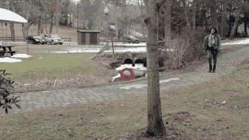

# Tracking-object-using-particle-fitler
# Tracking Objects in Video with a Particle Filter

Tracking a person walking through a noisy, shaky video with a **particle filter** written from scratch in Python (NumPy + OpenCV), with no tracking library.



*Green dots: the 500 particles. Red circle: the estimated position (mean of the particles).*

## The challenge

The video makes tracking hard on purpose:

- the camera is a digital camera, so **pixel values are noisy**
- the **camera direction keeps changing**
- the person's **profile changes** as she walks
- she walks **behind a tree and foliage** (partial occlusion)

## How it works

Each particle is a hypothesis of the target state `[x, y, vx, vy]`. For each video frame:

1. **Predict**: move every particle by its velocity, then keep it inside the frame
2. **Measure**: compare the colour of the pixel under each particle with the target colour (the blue top)
3. **Weight**: invert the colour error (low error → high weight) and raise it to a power to sharpen the selection
4. **Resample**: draw a new set of particles with probability proportional to the weights
5. **Estimate**: the target position is the mean of the resampled particles
6. **Diffuse**: add Gaussian noise to positions and velocities so the cloud can follow changes

| Parameter | Value |
|---|---|
| Particles | 500 |
| Position noise σ / velocity noise σ | 1.0 / 0.5 |
| Weight exponent | 4 |
| Initialisation | uniform over the frame, velocities centred on zero |

### What I observed

- **Velocity in the state makes the filter more robust**: particles whose velocity matches the target's survive resampling more often, so the cloud keeps moving with the target when the colour signal is weak (for example near the tree).
- **The weight exponent is a trade-off**: too low gives a loose cloud, too high makes the filter over-sensitive to colour and brightness changes.
- **It is not very sensitive to noise values**: reasonable settings of the position and velocity noise gave similar results, which is what you want from a robust method.
- **Few particles are enough**: results with fewer particles were similar, which makes the method suitable for small, low-power devices.

## Limitations

- **Colour-only likelihood**: lighting changes or similar colours in the background can attract particles.
- **Single target**, and tracking can be lost when the person is hidden for too long behind foliage.
- **Random initialisation**: the cloud needs a few frames to converge on the target.
- Results depend on the random seed (set to 0 for repeatability).

## Run it

```bash
pip install numpy opencv-python
python tracking_objects.py            # writes tracking_demo.mp4
python tracking_objects.py --show     # also shows a live window (Esc to quit)
```

Put `walking.mp4` in the same folder as the script.

## Files

```
├── tracking_objects.py    # clean, vectorised implementation
├── tracking_objects.ipynb # step-by-step notebook with explanations
├── walking.mp4            # input video
└── tracking_demo.gif      # result shown above
```

## Ideas for improvement

- Use a colour **histogram** (HSV) instead of one pixel colour
- Add a motion model with acceleration, or compare with a **Kalman filter**
- Track several targets, or re-detect the target after a long occlusion

## Author

**Dihia Lacene**: [GitHub](https://github.com/Lacenedihia) · [Portfolio](https://lacenedihia.netlify.app/)
